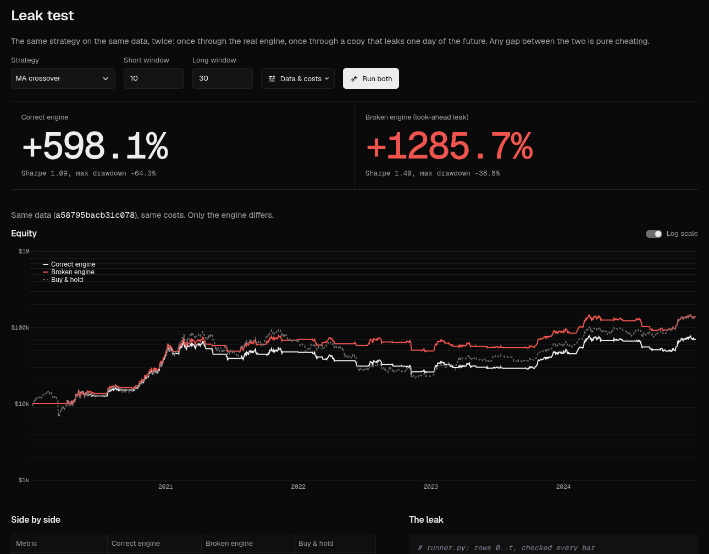
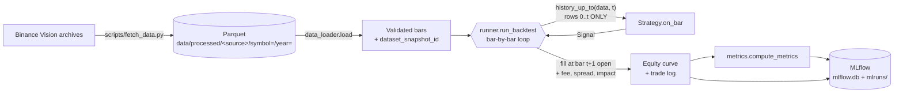
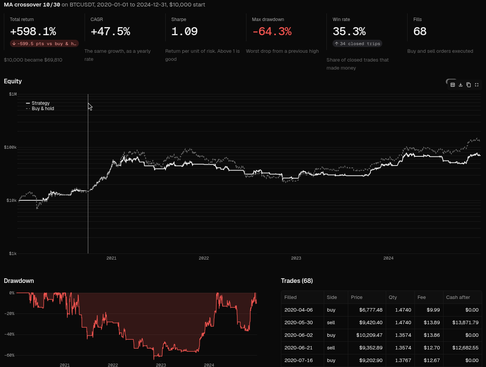
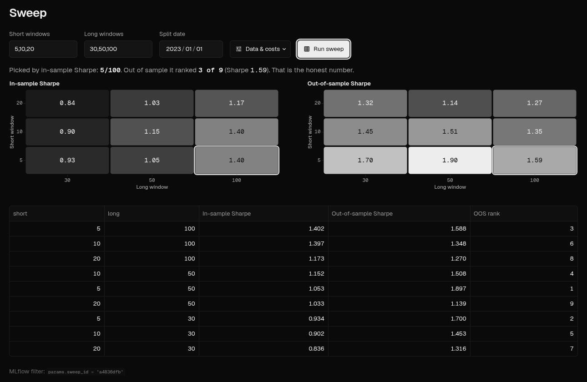
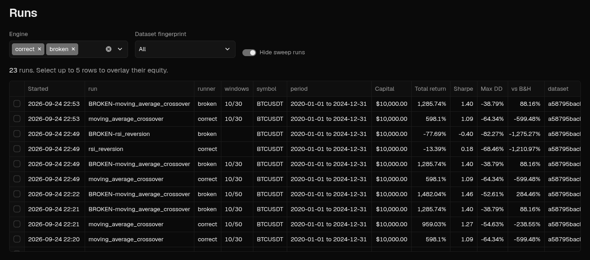

# Backtesting Engine

[](https://github.com/RindTel/backtesting/actions/workflows/ci.yml)

[](LICENSE)

**A trading backtester that structurally cannot see the future, and a deliberately
broken twin that shows how much a one-character leak inflates the results.**

It replays a strategy against historical prices one day at a time, charges realistic
costs on every fill, and logs every run as a reproducible MLflow experiment.
Everything runs locally: no API keys, no cloud, no database server.



## Headline result

The same strategies on the same data (Bitcoin daily bars 2020–2024, identical data
fingerprint, identical costs), run through the correct engine and through a copy with
two realistic one-line leaks:

| Strategy | Correct engine | Leaky engine | Inflation |
|---|---|---|---|
| Moving-average crossover 10/30 | +598% (Sharpe 1.09) | +1,286% (1.40) | 2.1× |
| Momentum 90 | +836% (1.20) | +3,866% (1.84) | 4.6× |
| Breakout 20/10 | +726% (1.18) | **+9,730%** (2.34) | **13×** |
| RSI mean reversion | −13% (0.18) | −78% (−0.40) | worse, not better |
| Buy & hold (benchmark) | +1,198% (1.12) | +1,200% | n/a |

None of the honest strategies beats buy-and-hold over this bull market. The point is
the engine, not alpha: +9,730% doesn't *look* impossible on Bitcoin, so a leak can't be
caught by eyeballing results. It has to be prevented by design and proven by a test.

## What this project demonstrates

- **Correctness by construction.** A strategy only ever receives a history slice that
  ends at the current bar, built in one audited function
  ([`runner.history_up_to`](runner.py)) that re-checks itself on every bar.
- **Proof by test, including tests of the tests.** A future-poisoning test replaces
  every price after a cut-off with garbage and requires every earlier decision to be
  unchanged, across all strategies and cost models. It is verified to catch the leaky
  engine and deliberately planted bugs. 160+ tests in total, with hand-derived expected
  numbers.
- **Realistic execution.** Next-bar-open fills, fee, half-spread, square-root market
  impact from trailing volatility and volume, and a daily volume cap that carries
  unfilled orders over. It shows strategy capacity: +598% at $10k, +292% at $1B.
- **Honest evaluation.** Buy-and-hold benchmark on every run, in-sample/out-of-sample
  split, and a parameter sweep that picks in-sample and reports out-of-sample rank.
- **Data engineering and reproducibility.** Checksum-verified downloads, a validated
  canonical schema, Hive-partitioned Parquet with Polars, and a content-hash dataset
  fingerprint on every MLflow run. Licensed data only, enforced by a pre-commit and CI
  guardrail.
- **A usable product.** A Streamlit app (backtest, leak test, run browser, sweep
  heatmaps) on the same engine as the CLI, with CI running lint, format and the offline
  test suite on every push.

## Quickstart

```bash
git clone https://github.com/RindTel/backtesting.git && cd backtesting
python3.12 -m venv .venv && source .venv/bin/activate
pip install -r requirements.txt
streamlit run app.py        # opens http://localhost:8501 on the bundled Bitcoin sample
```

No download is needed: a small licensed data sample ships in `data/sample/`. Start with
the **Leak test** page. Details on setup, the CLI and MLflow are below, and
[`demo_script.md`](demo_script.md) is a 10-minute guided walkthrough.

---

## Why this exists

Backtests are how trading ideas get judged, and they are very easy to get
subtly wrong. The most common and most damaging mistake is letting the
simulated strategy use information it could not have had at the time. The
results look great, the idea goes live, and the edge disappears, because it
was never an edge. It was a bug.

## The problem: look-ahead bias

**Look-ahead bias** is when a backtest's decision on day *t* is influenced by
data from day *t+1* or later. It almost never looks like cheating in the code.
Typical forms:

| Bug | What it looks like | Why it's a leak |
|---|---|---|
| Same-bar fill | Compute a signal from today's close, then "buy at today's close" | You can't trade at a price after you've already seen it and done the math. The earliest realistic fill is the next open. |
| Off-by-one slice | `data[:t + 2]` instead of `data[:t + 1]` | The strategy quietly sees tomorrow's bar. |
| Whole-series indicators | Normalizing with the full dataset's mean/max, or `shift(-1)`, or centered windows | Every early value is computed partly from future values. |
| Unsorted or duplicated data | A bar out of order or repeated | "Everything up to row *t*" can include rows from after *t*. |

The results of such a backtest are simply wrong. Usually they're too good, but
not always (see the demo numbers below), which is exactly why you can't catch
the bug by checking whether results "look suspicious".

## Architecture overview



| Module | Responsibility |
|---|---|
| `data_loader.py` | Fetch daily OHLCV from Binance Vision's archives (checksum-verified), normalize to one schema, validate (UTC, sorted, no duplicates), store as Parquet partitioned by symbol and year, load back, compute the dataset fingerprint. |
| `strategies/base_strategy.py` | The strategy interface: one method, `on_bar(historical_data_up_to_now, current_bar) -> Signal`. Its docstring explains why this signature prevents look-ahead. |
| `strategies/` | Five strategies (see [Strategies](#strategies)). Each computes everything from the slice it's handed, every bar. |
| `strategies/buy_and_hold.py` | Baseline: buy on day one, hold. |
| `runner.py` | **The correct runner.** An explicit day-by-day loop. `history_up_to` is the single function that builds what a strategy sees. |
| `broken_runner.py` | **A deliberately broken runner** with two look-ahead leaks. Demo only, clearly labeled, never imported by the real code path. |
| `metrics.py` | The only place any metric is computed: total return, CAGR, max drawdown (with dates), Sharpe, win rate. |
| `mlflow_logger.py` | The only place that talks to MLflow. Logs params, metrics, tags, the chart and the CSVs for one run. |
| `scripts/fetch_data.py` | CLI: download and store data. |
| `scripts/run_backtest.py` | CLI: run one backtest from stored data and log it. |

**Key design decisions**

- **Next-bar execution.** A decision made after seeing day *t*'s close is
  filled at day *t+1*'s **open**, never at day *t*'s close.
- **Costs are always applied.** A fee (default 0.1% of notional), a half-spread
  slippage (default 5 bps, always against you), and square-root market impact
  that grows with order size. `CostModel` refuses a zero fee or spread. See
  [Realistic costs](#realistic-costs-market-impact-and-capacity).
- **Stateless strategies.** A strategy recomputes everything from what it's
  handed each bar. Nothing is precomputed over the full dataset.
- **Fetching is separate from backtesting.** Backtests never touch the network,
  so two runs meant to use the same data really do.
- **The dataset fingerprint hashes the actual prices,** not just the symbol
  and dates. Providers revise history: Binance Vision's archives and Binance's
  live API disagree on the volume of 5 days in 2020–2021, for example. So
  "BTCUSDT 2020–2024" from two places can be two different datasets.

## Setup

Requires Python 3.12.

```bash
git clone https://github.com/RindTel/backtesting.git && cd backtesting
python3.12 -m venv .venv
source .venv/bin/activate
pip install -r requirements.txt
git config core.hooksPath .githooks   # enables the data-provenance pre-commit check
```

### Data

The repo ships a small sample: Bitcoin (BTCUSDT) daily bars for 2020–2024
from [Binance Vision](https://data.binance.vision) (80 KB) in `data/sample/`,
licensed CC BY-NC-SA 4.0 (see [Data and licensing](#data-and-licensing)).
Pass `--data-root data/sample` to run on it offline, with no download. That is
also what `demo_script.md` uses.

For anything else, fetch once into `data/processed/` (gitignored). Downloads
come from Binance Vision's monthly/daily archives, and each is checked
against its published SHA-256. No API key or account is needed:

```bash
python -m scripts.fetch_data --source binance --symbol BTCUSDT --start 2020-01-01 --end 2024-12-31
```

Each fetch prints the number of bars stored and the resulting `dataset_snapshot_id`.
Fetching an overlapping range later merges new bars in. It never deletes
what's already stored.

## The app

```bash
streamlit run app.py
```

Opens at <http://localhost:8501>. Red only ever means the broken engine, a loss or a
drawdown. Four pages in the top bar, all on the same engine as the CLI, and every run
is also logged to MLflow:

- **Backtest:** opens on a finished result. A slim control bar (strategy, windows,
  engine, split) sits over the headline numbers against buy-and-hold, a large
  equity chart, the drawdown curve and the trade log.
- **Leak test:** the correct and broken engines face off on identical data: their
  total returns side by side, one overlaid chart, the metrics table and the one
  line of code that differs.
- **Runs:** every logged run in a filterable table. Select rows to overlay their
  equity curves.
- **Sweep:** a grid of window pairs with in-sample and out-of-sample Sharpe
  heatmaps on one shared scale. It picks by in-sample only and reports the pick's
  out-of-sample rank.







Data and cost settings (sample or downloaded data, date range, capital, fee,
spread, impact, volume cap) live in the **Data & costs** popover on every page.
Identical settings reuse the stored result rather than logging a duplicate run.

The app only listens on `localhost`. To demo it to another device on your network,
start it with `streamlit run app.py --server.address 0.0.0.0` (anyone on that
network can then run backtests).

## Running a backtest

```bash
python -m scripts.run_backtest --source binance --symbol BTCUSDT \
    --start 2020-01-01 --end 2024-12-31 \
    --strategy moving_average_crossover --param short_window=10 --param long_window=30 \
    --data-root data/sample
```

Output:

```
[correct runner] moving_average_crossover on BTCUSDT 2020-01-01 → 2024-12-31
  total return +598.1% | CAGR +47.5% | Sharpe 1.09 | max drawdown -64.3% | 68 trades
  vs buy-and-hold: return +1197.6%, Sharpe 1.12 | excess return -599.5%
  dataset_snapshot_id a58795bacb31c078 | MLflow run <run id>
  View: mlflow ui --backend-store-uri sqlite:///mlflow.db --default-artifact-root ./mlruns
```

| Flag | Meaning | Default |
|---|---|---|
| `--source` | `binance` (Binance Vision) | required |
| `--symbol` | Binance spot pair, e.g. `BTCUSDT` | required |
| `--start`, `--end` | inclusive date range, `YYYY-MM-DD` | required |
| `--strategy` | `moving_average_crossover`, `momentum`, `breakout`, `rsi_reversion` or `buy_and_hold` | required |
| `--param KEY=VALUE` | strategy parameter, repeatable (names below) | strategy defaults |
| `--runner` | `correct`, or `broken` for the look-ahead demo | `correct` |
| `--fee-rate` | fee as a fraction of notional, must be > 0 | `0.001` |
| `--slippage-rate` | half-spread: adverse price move as a fraction, must be > 0 | `0.0005` |
| `--impact-coefficient` | square-root market impact constant; 0 disables | `1.0` |
| `--max-participation` | max fill per day as a fraction of average daily dollar volume; the rest carries over | `0.1` |
| `--capital` | starting cash | `10000` |
| `--data-root` | where stored bars live; `data/sample` for the committed sample | `data/processed` |
| `--split-date` | also log metrics before (in-sample) and from (out-of-sample) this date | off |

The backtest reads only stored data. If it's missing, the command exits with the
exact `fetch_data` command to run.

## Viewing results in MLflow

```bash
mlflow ui --backend-store-uri sqlite:///mlflow.db --default-artifact-root ./mlruns
```

Open <http://127.0.0.1:5000> and select the **`backtests`** experiment. Run
metadata is stored in `./mlflow.db` (SQLite) and artifacts under `./mlruns/`.
Both are local files. MLflow 3 no longer accepts a bare `./mlruns` directory
as its store by default, hence SQLite.

Each run contains:

| Kind | Contents |
|---|---|
| Parameters | strategy params, `symbol`, `source`, `start`, `end`, `initial_capital`, `fee_rate`, `slippage_rate`, `impact_coefficient`, `max_participation`, `strategy`, **`dataset_snapshot_id`** |
| Metrics | `total_return`, `cagr`, `sharpe_ratio`, `max_drawdown`, `win_rate`, `num_round_trips`, `num_trades`; the same set for buy-and-hold on the same data as `benchmark_*`, plus `excess_return` (strategy minus buy-and-hold); `in_sample_*` / `out_of_sample_*` with `--split-date` |
| Tags | **`runner`** (`correct` / `broken`), `dataset_snapshot_id`, max-drawdown peak/trough/recovery dates |
| Artifacts | `equity_curve.png`, `trades.csv` (every fill, with fees), `equity_curve.csv` |

What to look at:
- **Filter** real runs with `tags.runner = "correct"` in the search box.
- **Compare**: tick two or more runs and click *Compare* to see metrics and
  params side by side. An identical `dataset_snapshot_id` means they used
  identical data.
- **Artifacts** tab: the equity chart (max-drawdown period shaded) and the full trade log.

## Strategies

All long-only, all stateless: each one decides from the price history it's handed that
day, and nothing else. The future-poisoning test runs against every one of them.

| Strategy | Rule | Parameters (default) |
|---|---|---|
| `moving_average_crossover` | Buy when the short average crosses above the long one, sell on the reverse cross | `short_window` (20), `long_window` (50) |
| `momentum` | Buy when the price rises above where it was N days ago, sell when it drops back below | `lookback` (90) |
| `breakout` | Buy a close above the highest high of the last N days, sell a close below the lowest low of the last M | `entry_window` (20), `exit_window` (10) |
| `rsi_reversion` | Buy when the RSI crosses below the oversold level, sell when it crosses above overbought | `period` (14), `oversold` (30), `overbought` (70) |
| `buy_and_hold` | Buy on day one and never sell. The benchmark every run is compared against | none |

Results on the committed sample are in the [headline table](#headline-result).

## Realistic costs: market impact and capacity

A flat fee and spread treat a $10,000 order and a $1 billion order the same.
Real markets don't: big orders push the price against you. Every fill here pays

- **fee:** `fee_rate × notional`
- **spread:** the price moves `slippage_rate` against you
- **market impact:** the price moves a further `k × σ × √(order $ / ADV)`
  against you: the empirical *square-root law*. `σ` is daily-return volatility
  and `ADV` is average daily dollar volume, both over the previous 20 days.

On top of that, one day's fill is capped at `--max-participation` (10%) of ADV,
and the rest of the order keeps working on the following days.

Look-ahead matters here too: at day *t*'s open, day *t*'s volume and close
aren't known yet, so `σ` and `ADV` come only from the days *before* the fill
(`runner._market_conditions`). A test poisons everything about the fill day
except its opening price and checks that the fills don't change. A deliberately
unshifted version is caught.

The same 10/30 crossover on the Bitcoin sample, at three account sizes:

| Starting capital | Total return | Sharpe | Fills |
|---|---|---|---|
| $10,000 | +598% | 1.09 | 68 |
| $10 million | +445% | 0.98 | 68 |
| $1 billion | +292% | 0.86 | 648 (big orders split across days) |

A strategy's edge has a capacity. Without an impact model, a backtest can't tell you what it is.

## How this project prevents cheating

*A plain-English explanation. No code knowledge needed.*

Imagine testing a trader by replaying the last five years day by day.
Each morning, you hand them the newspaper, they decide what to do, and you
write it down. The test is only fair if you **never** accidentally hand them
tomorrow's paper. A trader who has read tomorrow's paper will look like a
genius, and it'll mean nothing.

Backtesting software has this problem constantly, because all ten years of
prices are sitting in one table in memory, and it takes one small slip to
let tomorrow's row through. So this project doesn't rely on being careful.
It makes the slip impossible:

1. **The strategy never gets the whole table.** Each simulated day, the
   engine cuts off a fresh copy of the price history that **ends at today**
   and hands the strategy only that. Tomorrow isn't hidden from it; tomorrow
   simply isn't in what it holds. There is nothing to peek at.
2. **The engine checks its own work every day.** Right after cutting, it
   confirms that the last row really is today. If it ever isn't, the run
   stops with an error. It never quietly continues.
3. **Trades happen tomorrow morning.** When the strategy decides to buy after
   seeing today's closing price, the purchase happens at tomorrow's opening
   price, the first price a real person could actually trade at, and it
   pays a fee and slippage.
4. **It's proven by a test, not just argued.** The test runs a strategy, then
   replaces every price after some date with garbage and runs it again.
   Every decision made *before* that date must come out exactly the same. If
   the strategy had been peeking, the garbage would have changed its earlier
   decisions.

**The proof that this matters: `broken_runner.py`.** The project keeps a
deliberately broken copy of the engine with two realistic one-line mistakes:
it hands the strategy one extra day of prices, and it lets trades happen at
the same closing price the decision was based on. Same strategy, same data
(same fingerprint), same fees:

| Bitcoin 2020–2024, moving-average crossover 10/30 | Total return | Sharpe | Worst drawdown |
|---|---|---|---|
| Correct engine | **+598%** | **1.09** | **−64%** |
| Broken engine | +1,286% | 1.40 | −39% |
| *Buy and hold, for reference* | *+1,198%* | *1.12* | *−77%* |

The broken engine **more than doubles** the result and makes it look far
safer, and nothing about the strategy changed. It even beats buy-and-hold,
which the honest version doesn't: exactly the kind of result that gets a
broken backtest believed. And the same poisoning test that the correct engine
passes **catches the broken one** (`tests/test_no_lookahead.py`). That's the
point: +1,286% on Bitcoin doesn't *look* impossible, so you can't catch a leak
by eyeballing the numbers. The protection has to be structural and tested.

For a guided walkthrough of this comparison, see [`demo_script.md`](demo_script.md).

### The other kind of cheating: tuning on the data you report

Look-ahead bias leaks the future *inside* a run. There is a second trap
*across* runs: try many parameter settings, keep the best one, and report its
numbers. The winner was chosen by looking at the same data it's being judged
on, so its results are too good in exactly the same way.

`--split-date` separates the two. Choose settings on the period before the
split (in-sample), then judge them only on the period after it
(out-of-sample). Both sets of metrics are logged to MLflow (`in_sample_*`,
`out_of_sample_*`). On the committed Bitcoin sample, split at 2023-01-01:

| MA crossover | In-sample Sharpe (2020–2022) | Out-of-sample Sharpe (2023–2024) |
|---|---|---|
| 20/50 | **1.03**: the one you'd pick | 1.14 |
| 10/30 | 0.90 | **1.45** |

The in-sample winner didn't stay the winner. (The demo's point is the gap
between the two engines, not the strategy's settings.)

```bash
python -m scripts.run_backtest --source binance --symbol BTCUSDT \
    --start 2020-01-01 --end 2024-12-31 --data-root data/sample \
    --strategy moving_average_crossover --param short_window=20 --param long_window=50 \
    --split-date 2023-01-01
```

#### Parameter sweeps, done honestly

`scripts/sweep.py` grid-searches the crossover windows, one MLflow run per
pair (all sharing a `sweep_id` param). It **requires** a split date, picks the
winner by in-sample Sharpe only, and then reports where that pick ranked out
of sample:

```bash
python -m scripts.sweep --source binance --symbol BTCUSDT \
    --start 2020-01-01 --end 2024-12-31 --data-root data/sample \
    --split-date 2023-01-01 --short 5,10,20 --long 30,50,100
```

On the sample, the in-sample winner (5/100, Sharpe 1.40) ranked 3rd of 9 out
of sample (1.59). The best out-of-sample pair (5/50, 1.90) was only 5th in-sample.
Judge a sweep by the out-of-sample column.

## Data and licensing

*Not legal advice. This is a reading of the providers' own terms, checked on 2026-09-24.*

**Binance Vision (the only data source).** Binance publishes its historical
market data at [data.binance.vision](https://data.binance.vision) under the
[Binance Vision Dataset Terms v1.0](https://data.binance.vision/Binance_Vision-Terms_of_Use.pdf)
(last updated 26 August 2026):

- **§3.1:** the datasets are licensed under
  [CC BY-NC-SA 4.0](https://creativecommons.org/licenses/by-nc-sa/4.0/).
- **§4.1:** permitted uses include "algorithmic historical backtesting for purely
  personal non-production research", "non-monetized open educational projects"
  and "non-commercial open-source data science evaluations". This project is one.
- **§4.5:** redistributed derivatives must credit Binance Vision and stay under
  CC BY-NC-SA 4.0. So `data/sample/` carries its own
  [`LICENSE.md`](data/sample/LICENSE.md) with that attribution and licence. The
  code is separately MIT-licensed ([`LICENSE`](LICENSE)).
- **§3.4:** any commercial use needs a separate enterprise licence from Binance.
- **§8.2:** this project is not sponsored, endorsed or approved by Binance.

The fetcher uses the Vision archives rather than Binance's live REST API on
purpose. Those archives are what the dataset licence clearly covers.

**Yahoo Finance: removed.** An earlier version fetched stock data with yfinance.
[Yahoo's Terms of Service](https://legal.yahoo.com/us/en/yahoo/terms/otos/index.html)
forbid reproducing or distributing its content without written permission
(§2.8) and collecting data "using any automated means" without permission
(§2.4(j)). yfinance's own README says the API "is intended for personal use
only". So Yahoo support was removed, and a guardrail keeps Yahoo data out of
the repo for good:

- `scripts/check_data_provenance.py` rejects any file whose path mentions
  yahoo/yfinance, and any data file with Yahoo-style columns (`Adj Close`,
  `Stock Splits`, `Dividends`, `Capital Gains`) or Yahoo mentions in its bytes.
- It runs as a pre-commit hook (`git config core.hooksPath .githooks`) and as a
  CI step on every push, so skipping the hook doesn't get data through.

## Metric definitions

All computed in [`metrics.py`](metrics.py), the only place in the project that computes them.

| Metric | Definition |
|---|---|
| Total return | `final equity / initial equity − 1` |
| CAGR | `(final / initial) ^ (1 / years) − 1`, with years from the actual calendar span (365.25-day years) |
| Max drawdown | largest peak-to-trough fall, as a negative fraction, with peak, trough and recovery dates |
| Sharpe ratio | `√(periods per year) × mean(excess per-bar return) / std`, sample std; 365 periods a year (crypto trades every day); risk-free rate configurable, default 0 |
| Win rate | fraction of closed round trips (entry to fully flat) with positive P&L **after** fees and slippage |

Undefined values (e.g. win rate with no closed trades, Sharpe of a flat curve) are reported as `NaN`, never as a misleading 0.

With `--split-date`, `metrics.split_metrics` computes the same set for each side of the split. A round trip
counts in the period in which it closes, and the out-of-sample returns are measured from the equity held at the split.

## Tests

```bash
pytest -m "not network"   # offline suite (what CI runs)
pytest                    # also downloads from Binance Vision for a live round trip
ruff check . && ruff format --check .   # lint + formatting (also in CI)
```

Highlights: hand-calculated P&L and metrics (every expected number is derived
in the test docstring), the future-poisoning test against both runners,
cost-model rules, data validation, the MLflow round trip, and the CLI end to end.

## Project layout

```
app.py, ui.py          Streamlit app (entry point, pages)
config.py              paths, cost defaults, MLflow settings
data_loader.py         fetch, validate, store, load, fingerprint
strategies/            BaseStrategy + Signal; crossover, momentum, breakout, RSI, buy & hold
runner.py              the look-ahead-safe runner  (start reviewing at history_up_to)
broken_runner.py       DELIBERATELY BROKEN runner, demo only
metrics.py             every performance number
mlflow_logger.py       every MLflow call
scripts/               fetch_data.py, run_backtest.py, sweep.py (CLIs)
tests/                 pytest suite
demo_script.md         live demo walkthrough
LICENSE                MIT (code); data/sample/ has its own licence
data/                  local Parquet store (gitignored)
mlflow.db, mlruns/     local MLflow store (gitignored)
```

## Limitations

- One symbol per run, long-only, daily bars, fractional share quantities.
- Costs are a fee, a fixed half-spread and square-root market impact. The spread
  doesn't widen in stressed markets, and there are no taxes, funding or borrow costs.
- A capped order's remainder is re-issued as the same signal. For a fractional
  `size`, that's a fraction of what's left, not the exact remainder.
- Crypto only (Binance spot pairs). Stock data was removed because Yahoo's
  terms don't allow it (see [Data and licensing](#data-and-licensing)).
- Data use is non-commercial: see [Data and licensing](#data-and-licensing).
- The strategies are deliberately simple. The point is the engine, not alpha.
  (Over 2020–2024, plain buy-and-hold Bitcoin returned +1,198%, beating the honest crossovers.)

## License

The code is released under the [MIT License](LICENSE). The market data sample in
`data/sample/` is not: it is Binance Vision data under CC BY-NC-SA 4.0, see
[`data/sample/LICENSE.md`](data/sample/LICENSE.md).
